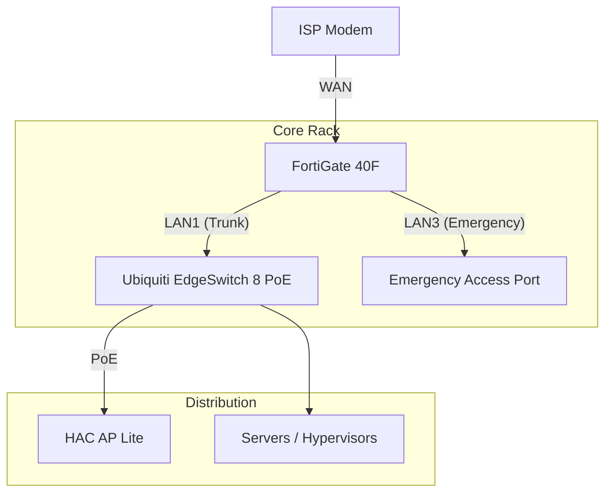
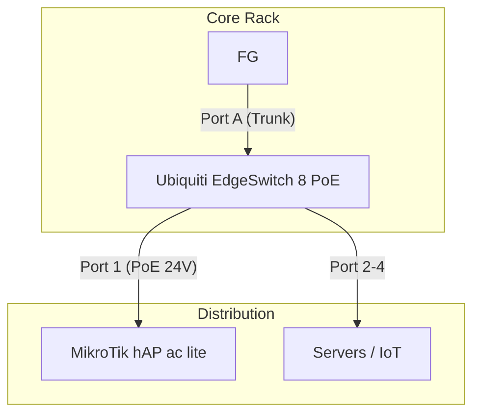

# Network Infrastructure

## 1. Overview
This document details the network topology, addressing schemes, and security policies for the **Packetflow Homelab**.  
The network provides a stable production environment for home services while allowing an isolated lab environment for experimentation under the domain `packetflow.be`.

**Key Stats:**
* **Primary Domain:** `packetflow.be` (Subdomain: `lab.packetflow.be`)
* **Router/Firewall:** FortiGate 40F
* **Core Switch:** Ubiquiti EdgeSwitch 8 PoE
* **Wireless:** HAC AP Lite
* **Site CIDR:** `10.10.0.0/16` (Home)

---

## 2. Basic Principles
The design and maintenance of this network adhere to the following core principles:

1.  **Strict Segmentation:**  
    - The "Home" network (`10.10.0.0/16`) is distinct from the reserved "Office" range (`10.20.0.0/16`).  
    - IoT and Guest traffic are isolated from the Management and Server VLANs.  
2.  **Positive Security Model (Explicit Allow):**  
    - The firewall operates on a "deny-by-default" basis.  
    - Traffic is only permitted if explicitly defined in the policy table; the default action is `DENY`.  
3.  **Management Isolation:**  
    - Management interfaces (Switching, Routing, IPMI) are restricted to **VLAN 99**.  
4.  **Physical Security:**  
    - Unused switch ports and the native VLAN on trunks are assigned to **VLAN 666 (Blackhole)** to prevent unauthorized physical access.  

---

## 3. Network Topology

### Layer 1: Physical Topology
The physical connection flow from the ISP modem to the core distribution layer.

### Layer 2: Data Link Topology
The data link layer configuration, including VLAN assignments and port assignments.

